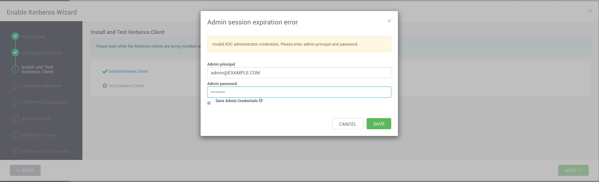

# dockerize-ambari

- https://github.com/containers/podman-compose

```
# for FreeIPA
sudo sysctl -w net.ipv4.ip_unprivileged_port_start=80

# for FreeIPA server container, use podman
$ podman-compose up --build --no-recreate

# clean way
$ podman-compose down
# remove related volumes if necessary
$ podman-compose up --build
```

## build rpms using apache/bigtop

I use `eub` branch in forked repository https://github.com/eubnara/bigtop because sometimes I need to test some patches for Hadoop or Ambari.


### using BGTP-1.0 on eubnara/bigtop

```
$ ./gradlew realclean ambari-pkg
$ ./gradlew realclean hadoop-pkg
$ ./gradlew realclean zookeeper-pkg
$ ./gradew realclean bigtop-ambari-mpack-pkg
```


### using BIGTOP-3.3.0 stack on apache/ambari

```
$ ./gradlew realclean ambari-pkg
# Since using BIGTOP-3.3.0 stack, "-PpkgSuffix", -PparentDir=/usr/bigtop is needed
## https://issues.apache.org/jira/browse/BIGTOP-3786
## https://issues.apache.org/jira/browse/AMBARI-25732
## https://github.com/apache/bigtop/pull/1035#issuecomment-1278367103
## https://github.com/apache/bigtop/pull/1038/files
## https://github.com/apache/ambari/blob/e68b7d39884895aec24198a13557666c815b7107/ambari-server/src/main/resources/stacks/BIGTOP/3.2.0/configuration/cluster-env.xml#L241
$ ./gradlew realclean hadoop-pkg -PpkgSuffix
$ ./gradlew realclean hadoop-pkg -PpkgSuffix -PparentDir=/usr/bigtop
$ ./gradlew realclean zookeeper-pkg -PpkgSuffix -PparentDir=/usr/bigtop

# I deploy BIGTOP-3.3.0 stack using customized mpack build
## https://github.com/eubnara/bigtop/commit/45c2384fc1c9e7cd9cd62195a066dee034fad25e
$ ./gradew realclean bigtop-ambari-mpack-pkg


```

### rpm location

```

# I add rpms using git lfs
# Some rpms are too big to add to git. So I upload on github release. (e.g. ambari-server, hadoop)
# https://github.com/eubnara/dockerize-ambari/releases
$ git lfs track yum-repo/rpm/*
```


## set repo url


```
http://ambari-yum-repo.example.com/repo
```

## Install Options


- Set private key using `id_rsa.ambari` file.


## enable kerberos


```
KDC hosts: ipa.example.com:88
Realm name: EXAMPLE.COM
Domains: .example.com,example.com
```
```
Kadmin host: ipa.example.com
Admin principal: uid=admin,cn=users,cn=accounts,dc=example,dc=com
Admin password: Secret123
```

```
# encryption type
aes256-cts-hmac-sha1-96
# and uncomment following lines in krb5-conf template
  renew_lifetime = 7d
  default_tgs_enctypes = {{encryption_types}}
  default_tkt_enctypes = {{encryption_types}}
```


```
[libdefaults]
  rdns = false
  ignore_acceptor_hostname = true
  allow_weak_crypto = true
```




After "Install Kerberos Client",
You need to copy `/etc/krb5.conf` from any of ambari-agents to ambari-server in order to contact ipa.example.com.

```
$ podman cp ambari-agent-1.example.com:/etc/krb5.conf ambari-server.example.com:/etc/krb5.conf
```

```
Admin principal: admin@EXAMPLE.COM
Admin password: Secret123
```


## certificate

```
ca.crt
ca.key
fullchain.crt
my-service.crt
my-service.csr
my-service.key
my-service.pfx
openssl.cnf
```

for `*.example.com` wildcard\
private key password: `Secret123`\
`freeipa` needs pkcs12 format, full chain certificate with private key


should not use privileged port for datanode because podman uses rootless

https://cwiki.apache.org/confluence/display/HADOOP/Secure+DataNode

```
# hdfs-site
dfs.http.policy=HTTPS_ONLY
dfs.data.transfer.protection=authentication
dfs.datanode.address=0.0.0.0:9866
dfs.datanode.http.address=0.0.0.0:9864
dfs.datanode.https.address=0.0.0.0:9865
dfs.datanode.ipc.address=0.0.0.0:9867
dfs.namenode.http-address=ambari-agent-1.example.com:9870
dfs.namenode.https-address=ambari-agent-1.example.com:9871
```


```
ssl.server.keystore.keypassword=Secret123
ssl.server.keystore.location=/etc/security/serverKeys/keystore.jks
ssl.server.keystore.password=Secret123
ssl.server.keystore.type=jks
ssl.server.truststore.location=/etc/pki/java/cacerts
ssl.server.truststore.password=changeit
```


## troubleshooting

### podman network issue

change cniVersion 1.0.0 to 0.4.0

https://github.com/containers/podman-compose/issues/752#issuecomment-2086374571


### https://issues.apache.org/jira/browse/AMBARI-26075

```
# for all ambari-agent
ln -snf hadoop-hdfs-datanode.pid hadoop-hdfs-root-datanode.pid
```
