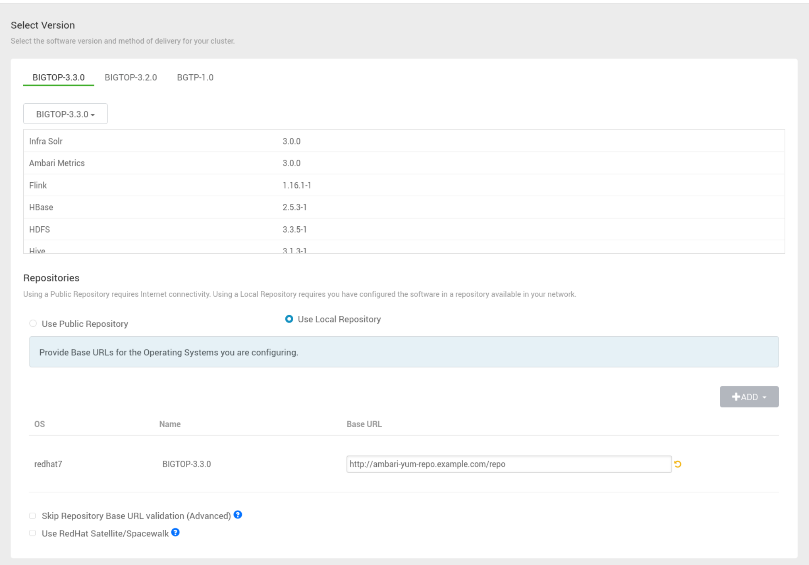

# dockerize-ambari

```
$ docker compose up --build --no-recreate


# clean way
$ docker compose down
# remove related volumes if necessary
$ docker compose up --build
```

## build rpms using apache/bigtop

I use `eub` branch in forked repository https://github.com/eubnara/bigtop. because sometimes I need to test some patches for Hadoop or Ambari.

```
$ ./gradlew realclean ambari-pkg
# Since using BIGTOP-3.2.0 stack, "-PpkgSuffix", -PparentDir=/usr/bigtop is needed
## https://issues.apache.org/jira/browse/BIGTOP-3786
## https://issues.apache.org/jira/browse/AMBARI-25732
## https://github.com/apache/bigtop/pull/1035#issuecomment-1278367103
## https://github.com/apache/bigtop/pull/1038/files
## https://github.com/apache/ambari/blob/e68b7d39884895aec24198a13557666c815b7107/ambari-server/src/main/resources/stacks/BIGTOP/3.2.0/configuration/cluster-env.xml#L241
./gradlew realclean hadoop-pkg -PpkgSuffix
$ ./gradlew realclean hadoop-pkg -PpkgSuffix -PparentDir=/usr/bigtop
$ ./gradlew realclean zookeeper-pkg -PpkgSuffix -PparentDir=/usr/bigtop

# I delploy BIGTOP-3.2.0 stack using customized mpack build
## https://github.com/eubnara/bigtop/commit/45c2384fc1c9e7cd9cd62195a066dee034fad25e
$ ./gradew realclean bigtop-ambari-mpack-pkg

# I add rpms using git lfs
# Some rpms are too big to add to git. So I upload on github release. (e.g. ambari-server, hadoop)
# https://github.com/eubnara/dockerize-ambari/releases
$ git lfs track yum-repo/rpm/*
```


## set repo url


```
http://dockerize-ambari-yum-repo-1/repo
```

## Install Options


- Set private key using `id_rsa.ambari` file.


## enable kerberos


```
KDC hosts: apache-ds.example.com:60088
Realm name: EXAMPLE.COM
LDAP url: ldaps://apache-ds.example.com:10636
Container DN: ou=services,dc=example,dc=com
Domains: .example.com,example.com
```
```
Kadmin host: apache-ds.example.com:60088
Admin principal: uid=admin,ou=system
Admin password: secret
```

```
# encryption type
aes256-cts-hmac-sha1-96
# and uncomment following lines in krb5-conf template
  renew_lifetime = 7d
  default_tgs_enctypes = {{encryption_types}}
  default_tkt_enctypes = {{encryption_types}}
```
